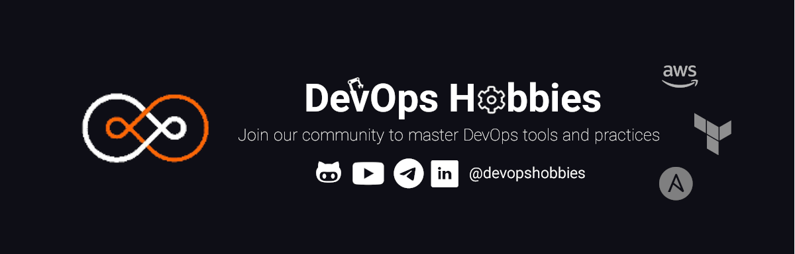

DevOps Hobbies is an open-source community focused on providing free educational content on DevOps tools. Our goal is to foster collaboration, exchange of ideas, and knowledge sharing among DevOps enthusiasts. We welcome contributions from anyone who shares our passion for DevOps. Join us today to learn from experts, access informative content, and become a part of our thriving community.

## Project Roadmap

We as a DevOps Community prepared a completed road map for whoever likes to start his/shes journey to become a DevOps Engineer.
You can find The road map at [DevOps Ultimate Roadmap](https://github.com/ahmadalibagheri/devops-roadmap).

## List of courses

| Icon                                                                                                                  | Course Name                 | Repository                                                                              | Youtube                                                                                         |
| --------------------------------------------------------------------------------------------------------------------- | --------------------------- | --------------------------------------------------------------------------------------- | ----------------------------------------------------------------------------------------------- |
|                                               | AWZ                         | -----------------                                                                       | [PlayList](https://youtube.com/playlist?list=PLYrn63eEqAzYkIa-FUZ2Jaq94ac9qlS0l)                |
|                                 | AWZ Webinar                 | [aws-webinar](https://github.com/devopshobbies/aws-webinar)                             | [PlayList](https://youtube.com/playlist?list=PLYrn63eEqAzaCqGENAmDSrLwpTxQV0RIx)                |
|                                    | Terraform From Zero To Hero | [terraform-tutorial](https://github.com/devopshobbies/terraform-tutorial)               | [PlayList](https://youtube.com/playlist?list=PLYrn63eEqAzZssgLu8Um_k1v8Pvh7-l7b)                |
|                                            | MinIO                       | [MinIO-tutorial](https://github.com/devopshobbies/MinIO-tutorial)                       | [PlayList](https://www.youtube.com/watch?v=y4of6U-mdVQ&list=PLYrn63eEqAzaS7mHcJh7GPOFWcLHLxlfE) |
|                  | NetOps                      | [NetOps Roadmap](https://github.com/devopshobbies/MinIO-tutorial)                       | [PlayList](https://youtube.com/playlist?list=PLYrn63eEqAzaydfpPB9tTFVTUTkneP6EN)                |
|                                            | Django + Docker CD/CI       | [django-ci-cd-EmbedProject](https://github.com/devopshobbies/django-ci-cd-EmbedProject) | [PlayList](https://youtube.com/playlist?list=PLYrn63eEqAzY5uG5ks_OquWcojzHvhp9Z)                |
|                                            | Docker                      | [docker-templates](https://github.com/devopshobbies/docker-templates)                   | [PlayList](https://youtube.com/playlist?list=PLYrn63eEqAzY8kqHVepGiVUrTmE0wjLII)                |
|  | Teamcity server             | -----------------                                                                       | [PlayList](https://youtube.com/playlist?list=PLYrn63eEqAzaJnZaUw2QkOgpkiwRjYIvC)                |
|                                           | Ansible                     | -----------------                                                                       | [PlayList](https://youtube.com/playlist?list=PLYrn63eEqAzb4NrSDKlyJvG_I7cbNdW1l)                |

## Contributing

We are more than welcome with contributors of any. If you don't know where to start and how to start then you can reach us on telegram.
There are several repositories that you can help them to grow. Of course this is just the start and we are going to launch more open source projects.
